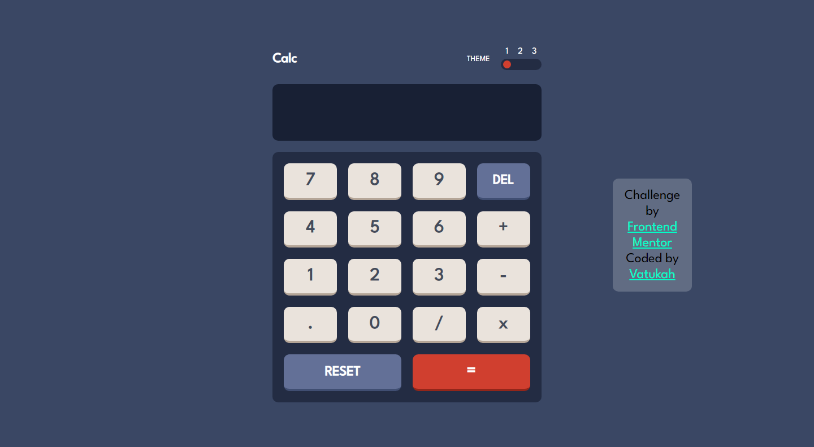
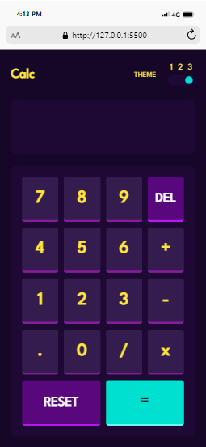

# Frontend Mentor - Calculator app solution

This is a solution to the [Calculator app challenge on Frontend Mentor](https://www.frontendmentor.io/challenges/calculator-app-9lteq5N29). Frontend Mentor challenges help you improve your coding skills by building realistic projects. 

## Table of contents

- [Overview](#overview)
  - [The challenge](#the-challenge)
  - [Screenshot](#screenshot)
  
- [My process](#my-process)
  - [Built with](#built-with)
  - [What I learned](#what-i-learned)
- [Author](#author)


## Overview

### The challenge

Users should be able to:

- See the size of the elements adjust based on their device's screen size
- Perform mathmatical operations like addition, subtraction, multiplication, and division
- Adjust the color theme based on their preference
- **Bonus**: Have their initial theme preference checked using `prefers-color-scheme` and have any additional changes saved in the browser

### Screenshot


.png)
.png)

.png)
.png)


## My process

### Built with

- Semantic HTML5 markup
- CSS custom properties
- Flexbox
- CSS Grid


### What I learned

while working on this project i learned how to use the "prefer-color-scheme " in css
with media query.

To see how you can add code snippets, see below:

```css
    */
@media (prefers-color-scheme: light) {
  body {
    background: hsl(0, 0%, 90%);
  }
  #toggleBtn {
    background: hsl(25, 98%, 40%);
  }
  #toggle {
    background: hsl(0, 5%, 81%);
    justify-content: center;
  }
  #Calc_display {
    background: hsl(0, 0%, 93%);
    color: hsl(60, 10%, 19%);
  }
  #top {
    color: hsl(60, 10%, 19%);
  }}
```


## Author
- Frontend Mentor - [@Vatukah](https://www.frontendmentor.io/profile/Vatukah)


